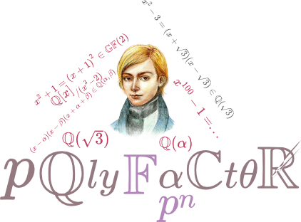

<p align="center">
  <a href="https://github.com/archie1602/polyfactor">
    
  </a>
</p>

<h3 align="center">

[](https://www.nuget.org/packages/polyfactor/)
[](LICENSE.md)

</h3>

## About

**polyfactor** is an open source, lightweight library whose main purpose is to solve polynomial factorization problem over $GF(p), GF(p^n), \mathbb{Q}, \mathbb{Q}(\alpha)$ fields.

**Notes: Currently, only factorization of univariate polynomials over $GF(p)$ is supported.**

Implemented factorization methods:
1. Berlekamp
2. Cantor-Zassenhaus
3. Kaltofen-Shoup

## Usage
polyfactor library can be used in any .NET project that targets `.net standard 2.0` or `.net 6.0`.
But the easiest way to use `polyfactor` library - `Jupyter Notebook` and `JupyterLab` notebooks.

### Console Application

**easiest way:**

`.net 6:`
```csharp
using polyfactor.Extensions;

var factors = "x^100+1".Factor(5);
```

`.net standard 2.0:`

```csharp
using polyfactor.Extensions;

namespace polyfactorExample
{
    class Program
    {
        static void Main(string[] args)
        {
            var factors = "x^100+1".Factor(5);
        }
    }
}
```

**little more detail:**

`.net 6:`
```csharp
using polyfactor.GaloisStructs;

// create galois field GF(5)
var gf = new GF(5);

// create polynomial over GF(5)
var pol = new GFPoly(gf, "x^100+1");

// apply factorization to the pol
var factors = pol.Factor();
```

`.net standard 2.0:`

```csharp
using polyfactor.GaloisStructs;

namespace polyfactorExample
{
    class Program
    {
        static void Main(string[] args)
        {
            // create galois field GF(5)
            var gf = new GF(5);

            // create polynomial over GF(5)
            var pol = new GFPoly(gf, "x^100+1");

            // apply factorization to the pol
            var factors = pol.Factor();
        }
    }
}
```


## License
The `polyfactor` is open source library and distributed under MIT license.